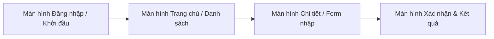

# [VẬN DỤNG CƠ BẢN] Chuẩn Hóa Dữ Liệu Khách Hàng (Dạng Chuẩn 1NF)

> 👤 **Học viên:** Đỗ Hoàng Sơn | **Mã SV:** PTIT-HCM-066
> 🏫 **Môn học:** IT105-K25-Phan-tich-thi-t-k-h-th-ng

---

## 🎨 Thiết kế Giao diện UI/UX trên Figma (Wireframe & Prototype)

> 🔗 **Figma Design Canvas:** [Mở Artboard Thiết kế trên Figma](https://www.figma.com/design/gjrJ159dZ8V9RfxDKaR8U1/van-dung-co-ban-chuan-hoa-du-lieu-k?node-id=0%3A1&m=dev)  
> 🚀 **Figma Interactive Prototype:** [Trải nghiệm Bản mẫu Tương tác Prototype](https://www.figma.com/proto/gjrJ159dZ8V9RfxDKaR8U1/van-dung-co-ban-chuan-hoa-du-lieu-k?page-id=0%3A1&node-id=1%3A2&viewport=256%2C48%2C0.5&scaling=scale-down&starting-point-node-id=1%3A2)  
> 📋 Chi tiết thông số Design System và wireframe đầy đủ xem tại file: [**`bt2_FIGMA.md`**](bt2_FIGMA.md)

### 📱 Sơ đồ luồng tương tác màn hình (UI Navigation Flow)

### 🎯 Bảng màu & Quy chuẩn thiết kế giao diện

| Thành phần Token | Giá trị HEX / Quy cách | Mục đích sử dụng |
| :--- | :---: | :--- |
| Primary Brand | `#2563EB` | Màu chủ đạo, nút bấm chính (CTA), active state |
| Secondary Accent | `#3B82F6` | Màu bổ trợ, link tương tác, thanh trạng thái |
| Background Surface | `#F8FAFC` / `#FFFFFF` | Nền tổng thể và bề mặt các card giao diện |
| Typography | Inter / Roboto (24px, 18px, 14px, 12px) | Font chữ tiêu chuẩn, rõ nét đa độ phân giải |
| 8-Point Grid | Spacing 8px, 16px, 24px, 32px | Đảm bảo tỷ lệ cân đối và bố cục hài hòa |

---

## Phần 1: Phân tích lỗi vi phạm chuẩn 1NF

Trong thiết kế cơ sở dữ liệu hiện tại của Rikkei Cinema, hai thuộc tính 'FavoriteGenres' và 'ContactInfo' đang vi phạm nghiêm trọng tính nguyên tử (Atomic) của dạng chuẩn 1NF do chứa nhiều giá trị hoặc dữ liệu phức hợp trong cùng một ô.

- Thuộc tính 'FavoriteGenres' là thuộc tính đa trị (Multi-valued attribute): Một hội viên có thể thích nhiều thể loại phim khác nhau nhưng lại được lưu gộp chung vào một chuỗi văn bản (ví dụ: 'Action, Comedy'). Điều này dẫn đến bẫy dữ liệu khi nhân viên nhập liệu vô tình thêm khoảng trắng hoặc dấu phẩy thừa (ví dụ: 'Action , , Comedy'), làm cho các câu lệnh truy vấn LIKE '%Action%' trả về kết quả sai lệch hoặc không khớp.
- Thuộc tính 'ContactInfo' là thuộc tính phức hợp (Composite attribute): Gộp chung cả số điện thoại và địa chỉ email vào chung một trường. Hệ quả là hệ thống không thể thực hiện các thao tác tách rời như gửi SMS tự động tới riêng số điện thoại hoặc gửi chiến dịch email marketing tới riêng địa chỉ email.

## Phần 2: Phương án thiết kế lại cơ sở dữ liệu đạt chuẩn 1NF

Để khắc phục triệt để các bất thường dữ liệu trên và đưa mô hình về dạng chuẩn 1NF, ta tiến hành tách thực thể CUSTOMER và chuẩn hóa các thuộc tính như sau:

- Ràng buộc nghiệp vụ bổ sung: Cột 'Email' trong bảng CUSTOMER phải được thiết lập cho phép nhận giá trị NULL để phù hợp với thực tế hội viên cũ không cung cấp email.
- Khóa ngoại: Bảng trung gian 'CUSTOMER_GENRE' thiết lập quan hệ nhiều-nhiều giữa hội viên và thể loại phim, sử dụng khóa ngoại trỏ về bảng 'CUSTOMER' và bảng 'GENRE'.

| Thực thể / Bảng | Thuộc tính ban đầu (Lỗi) | Phương án chuẩn hóa (TO-BE) | Giải thích nghiệp vụ kỹ thuật |
| --- | --- | --- | --- |
| CUSTOMER | ContactInfo (Gộp SĐT và Email) | Tách thành hai cột riêng biệt: PhoneNumber và Email | Đảm bảo tính nguyên tử, cho phép truy vấn chính xác và hỗ trợ cột Email nhận giá trị NULL đối với các hội viên cũ chỉ đăng ký số điện thoại. |
| GENRE & CUSTOMER_GENRE | FavoriteGenres (Đa trị, lưu gộp chuỗi) | Tách thành bảng GENRE (GenreID, GenreName) và bảng trung gian CUSTOMER_GENRE (CustomerID, GenreID) | Giải quyết triệt để vấn đề dữ liệu đa trị, loại bỏ hoàn toàn bẫy nhập liệu dấu phẩy/khoảng trắng và giúp thống kê chính xác lượng khách hàng yêu thích từng thể loại phim. |

## Thiết kế Giao diện UI/UX trên Figma & Bảng đặc tả Wireframe

Hệ thống giao diện được phân tích và thiết kế trực quan trên nền tảng Figma, đảm bảo trải nghiệm người dùng tối ưu theo quy chuẩn UI/UX hiện đại.

Link trực tiếp xem Artboard thiết kế Figma: https://www.figma.com/design/gjrJ159dZ8V9RfxDKaR8U1/van-dung-co-ban-chuan-hoa-du-lieu-k?node-id=0%3A1&m=dev

Link trải nghiệm tương tác trực tiếp (Figma Prototype): https://www.figma.com/proto/gjrJ159dZ8V9RfxDKaR8U1/van-dung-co-ban-chuan-hoa-du-lieu-k?page-id=0%3A1&node-id=1%3A2&viewport=256%2C48%2C0.5&scaling=scale-down&starting-point-node-id=1%3A2

Bảng đặc tả hệ thống thiết kế (Design System) và thông số kỹ thuật giao diện:

| Thành phần / Token | Giá trị quy chuẩn | Mục đích sử dụng |
| --- | --- | --- |
| Primary Brand Color | #2563EB | Màu nhận diện thương hiệu, nút hành động chính (CTA) |
| Secondary Accent | #3B82F6 | Màu bổ trợ, link điều hướng, active tab |
| Background & Card | #F8FAFC / #FFFFFF | Nền tổng thể và bề mặt các khối thẻ thông tin |
| Typography | Inter / Roboto (24px, 18px, 14px, 12px) | Hệ phông chữ hiển thị rõ nét, tương phản chuẩn |
| Grid System | 8pt Grid, Mobile 4 cols / Web 12 cols | Quy chuẩn khoảng cách lề và bố cục cân đối |
| Figma Design Canvas | https://www.figma.com/design/gjrJ159dZ8V9RfxDKaR8U1/van-dung-co-ban-chuan-hoa-du-lieu-k?node-id=0%3A1&m=dev | Mở file thiết kế artboard gốc trên Figma |
| Figma Prototype Link | https://www.figma.com/proto/gjrJ159dZ8V9RfxDKaR8U1/van-dung-co-ban-chuan-hoa-du-lieu-k?page-id=0%3A1&node-id=1%3A2&viewport=256%2C48%2C0.5&scaling=scale-down&starting-point-node-id=1%3A2 | Trải nghiệm mô phỏng chuyển động và luồng thao tác |

---

## 📁 Danh sách tệp tin nộp bài trong Repository
- 📝 `bt2.docx`: Báo cáo tài liệu phân tích nghiệp vụ hoàn chỉnh.
- 🎨 [Figma Design Canvas](https://www.figma.com/design/gjrJ159dZ8V9RfxDKaR8U1/van-dung-co-ban-chuan-hoa-du-lieu-k?node-id=0%3A1&m=dev): Không gian làm việc Artboard thiết kế UI/UX trên Figma.
- 🚀 [Figma Live Prototype](https://www.figma.com/proto/gjrJ159dZ8V9RfxDKaR8U1/van-dung-co-ban-chuan-hoa-du-lieu-k?page-id=0%3A1&node-id=1%3A2&viewport=256%2C48%2C0.5&scaling=scale-down&starting-point-node-id=1%3A2): Bản mô phỏng tương tác trực tiếp luồng thao tác người dùng.
- 📋 `bt2_FIGMA.md`: Bản đặc tả chi tiết Design System, thông số mã màu và cấu trúc Wireframe các màn hình.
