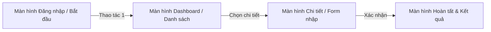

# 🎨 BẢN ĐẶC TẢ THIẾT KẾ GIAO DIỆN UI/UX TRÊN FIGMA

> 👤 **Học viên:** Đỗ Hoàng Sơn | **Mã SV:** PTIT-HCM-066
> 🏫 **Môn học:** IT105-K25-Phan-tich-thi-t-k-h-th-ng
> 📌 **Bài tập:** Bài 2 - Session 15
> 🏷️ **Dự án thiết kế:** [VẬN DỤNG CƠ BẢN] Chuẩn Hóa Dữ Liệu Khách Hàng (Dạng Chuẩn 1NF)

---

## 🔗 LIÊN KẾT TRỰC TIẾP DỰ ÁN FIGMA

[](https://www.figma.com/design/gjrJ159dZ8V9RfxDKaR8U1/van-dung-co-ban-chuan-hoa-du-lieu-k?node-id=0%3A1&m=dev)
[](https://www.figma.com/proto/gjrJ159dZ8V9RfxDKaR8U1/van-dung-co-ban-chuan-hoa-du-lieu-k?page-id=0%3A1&node-id=1%3A2&viewport=256%2C48%2C0.5&scaling=scale-down&starting-point-node-id=1%3A2)

- 🎨 **Figma Design Canvas (Artboards, Styles & Design Tokens):**  
  👉 [https://www.figma.com/design/gjrJ159dZ8V9RfxDKaR8U1/van-dung-co-ban-chuan-hoa-du-lieu-k?node-id=0%3A1&m=dev](https://www.figma.com/design/gjrJ159dZ8V9RfxDKaR8U1/van-dung-co-ban-chuan-hoa-du-lieu-k?node-id=0%3A1&m=dev)
- 🚀 **Figma Interactive Prototype (Trải nghiệm tương tác luồng người dùng):**  
  👉 [https://www.figma.com/proto/gjrJ159dZ8V9RfxDKaR8U1/van-dung-co-ban-chuan-hoa-du-lieu-k?page-id=0%3A1&node-id=1%3A2&viewport=256%2C48%2C0.5&scaling=scale-down&starting-point-node-id=1%3A2](https://www.figma.com/proto/gjrJ159dZ8V9RfxDKaR8U1/van-dung-co-ban-chuan-hoa-du-lieu-k?page-id=0%3A1&node-id=1%3A2&viewport=256%2C48%2C0.5&scaling=scale-down&starting-point-node-id=1%3A2)

---

## 🎯 1. HỆ THỐNG THIẾT KẾ (DESIGN SYSTEM & TOKENS)

### 🎨 Bảng mã màu chuẩn (Color Palette)

| Tên Token | Mã HEX | Vai trò & Ứng dụng |
| :--- | :---: | :--- |
| Primary Brand | `#2563EB` | Màu nhận diện thương hiệu, nút hành động chính (CTA), active state |
| Secondary Accent | `#3B82F6` | Màu bổ trợ, link tương tác, trạng thái hover, tab đang chọn |
| Background Canvas | `#F8FAFC` | Nền tổng thể ứng dụng (Light mode chuẩn tương phản) |
| Surface Card | `#FFFFFF` | Nền các khối thẻ thông tin, ô nhập liệu form, modal popup |
| Text Primary | `#0F172A` | Tiêu đề chính, văn bản có độ tương phản cao nhất |
| Text Secondary | `#64748B` | Mô tả phụ, nhãn phụ, gợi ý placeholder |
| Success Green | `#10B981` | Thông báo thành công, trạng thái hợp lệ |
| Danger Red | `#EF4444` | Báo lỗi validate form, trạng thái từ chối / cảnh báo |

### ✍️ Quy chuẩn Typography & Font chữ

- **Font Family:** `Inter`, `Roboto`, `system-ui` (Độ rõ nét cao trên mọi màn hình).
- **H1 (Header chính màn hình):** 24px - Bold (700) - Line height 32px.
- **H2 (Tiêu đề phân đoạn / Block header):** 18px - SemiBold (600) - Line height 24px.
- **Body Text (Nội dung văn bản):** 14px - Regular (400) - Line height 20px.
- **Caption & Footnote:** 12px - Medium (500) - Line height 16px.

### 📐 Hệ thống Lưới & Khoảng cách (Grid & Spacing)

- **Quy tắc 8-Point Grid:** Toàn bộ khoảng cách lề (margin), khoảng cách đệm (padding) tuân thủ bội số của 8 (8px, 16px, 24px, 32px, 48px).
- **Bố cục Layout Grid:** Mobile 4 cột (Margin 16px, Gutter 16px) hoặc Web Responsive 12 cột (Max-width 1200px, Gutter 24px).

---

## 📱 2. SƠ ĐỒ LUỒNG ĐIỀU HƯỚNG GIAO DIỆN (UI FLOW)



---

## 📐 3. ĐẶC TẢ CHI TIẾT CÁC MÀN HÌNH WIREFRAME

### 📱 Màn hình 1: Trang chủ / Tổng quan (Dashboard)

> 💡 **Mục đích:** Hiển thị thông tin tổng quan, số liệu thống kê nhanh và các nút lối tắt điều hướng chức năng chính.

**Các thành phần UI chính:**
- 🔹 Header với Logo & Avatar
- 🔹 Khối tóm tắt số liệu (Quick Stats)
- 🔹 Thanh tìm kiếm & Lối tắt
- 🔹 Bottom Navigation / Sidebar

**Bố cục Wireframe & Phân vùng màn hình:**
```text
Top Bar (Header cố định) -> Khối Banner/Stats -> Danh sách nghiệp vụ nổi bật -> Footer/Bottom Bar.
```

### 📱 Màn hình 2: Danh sách & Bộ lọc dữ liệu (Data List & Filters)

> 💡 **Mục đích:** Cho phép người dùng tra cứu, phân loại, sắp xếp và quản lý toàn bộ các bản ghi trong hệ thống.

**Các thành phần UI chính:**
- 🔹 Thanh tìm kiếm theo từ khóa
- 🔹 Thanh lọc trạng thái (Filter Chips / Dropdown)
- 🔹 Bảng/Thẻ dữ liệu chi tiết
- 🔹 Phân trang (Pagination)

**Bố cục Wireframe & Phân vùng màn hình:**
```text
Header -> Thanh công cụ tìm kiếm và lọc -> Danh sách hiển thị cuộn -> Nút hành động nhanh (Floating Action Button).
```

### 📱 Màn hình 3: Biểu mẫu nhập liệu & Thao tác chi tiết (Form & Action Screen)

> 💡 **Mục đích:** Nơi người dùng nhập thông tin, tải tệp, kiểm tra tính hợp lệ dữ liệu và gửi yêu cầu xử lý.

**Các thành phần UI chính:**
- 🔹 Nút quay lại (Back Button)
- 🔹 Các trường nhập liệu (Inputs) có validation cảnh báo
- 🔹 Khu vực tải lên tài liệu/ảnh
- 🔹 Nút bấm hành động chính (Primary Submit CTA)

**Bố cục Wireframe & Phân vùng màn hình:**
```text
Header có tiêu đề form -> Khối thông tin nhập liệu dạng cuộn -> Thanh nút Lưu/Hủy cố định ở chân trang.
```

### 📱 Màn hình 4: Thông báo xác nhận & Kết quả xử lý (Confirmation & Feedback Modal)

> 💡 **Mục đích:** Xác thực hành động quan trọng, phòng tránh thao tác nhầm lẫn và cung cấp phản hồi trực quan sau khi hoàn tất.

**Các thành phần UI chính:**
- 🔹 Biểu tượng trạng thái (Icon Success / Warning)
- 🔹 Thông điệp tóm tắt kết quả
- 🔹 Mã số biên lai / Mã giao dịch
- 🔹 Nút điều hướng tiếp theo (Về trang chủ / In kết quả)

**Bố cục Wireframe & Phân vùng màn hình:**
```text
Modal Dialog căn giữa màn hình hoặc màn hình trạng thái toàn trang -> Nút hành động chính và phụ ở đáy.
```

---

## 🛠️ 4. HƯỚNG DẪN XEM VÀ KIỂM TRA TRÊN FIGMA

1. **Chế độ xem Thiết kế (Design Canvas):** Nhấp vào link [Figma Design Canvas](https://www.figma.com/design/gjrJ159dZ8V9RfxDKaR8U1/van-dung-co-ban-chuan-hoa-du-lieu-k?node-id=0%3A1&m=dev) để xem toàn bộ hệ thống Artboard, phân lớp Layer, Auto-layout và các Components.
2. **Chế độ chạy thử nghiệm (Interactive Prototype):** Nhấp vào link [Figma Live Prototype](https://www.figma.com/proto/gjrJ159dZ8V9RfxDKaR8U1/van-dung-co-ban-chuan-hoa-du-lieu-k?page-id=0%3A1&node-id=1%3A2&viewport=256%2C48%2C0.5&scaling=scale-down&starting-point-node-id=1%3A2) để trực tiếp click thử nghiệm các tương tác chuyển trang, hiệu ứng Smart Animate và luồng thao tác người dùng.
